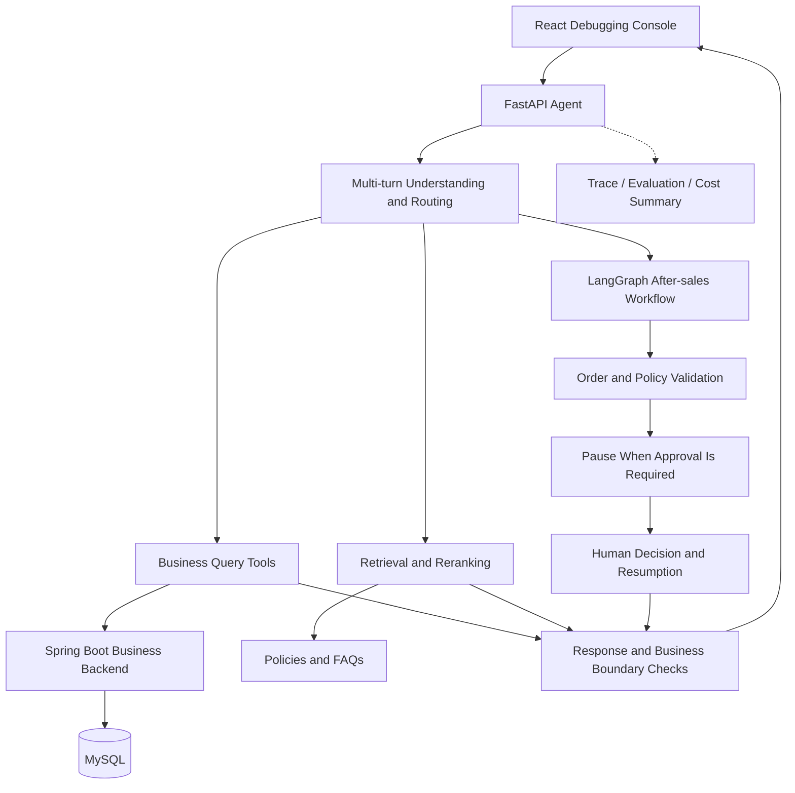

# E-commerce Customer Service Agent

An AI customer service system for product inquiries, order tracking, and refund and return requests. It retrieves business facts through tool calls, searches policies and FAQs with Hybrid RAG, and manages after-sales workflows with LangGraph and human approval.

The project includes an **Agent service, a React debugging console, and a Spring Boot business backend**. You can inspect query interpretation, retrieval, tool calls, workflow state, and final responses locally.

## Features

| Feature | Description |
| --- | --- |
| Multi-turn understanding | Resolves references from conversation history and builds structured query plans, carrying forward date, amount, and product filters |
| Business queries | Looks up prices, inventory, orders, shipping, and refund status; supports order filtering, counts, and amount totals |
| Hybrid RAG | Combines knowledge-domain routing, vector and keyword retrieval, model reranking, secondary retrieval through tools, and evidence coverage checks |
| Grounded responses | Includes source citations and retrieval-stage metadata for policy answers; explains limitations or suggests human verification when evidence is insufficient |
| After-sales workflows | Checks order facts and policy conditions, with separate paths for refunds before shipment and returns after delivery |
| Human approval | Supports pause, approval, rejection, requests for more information, and resumption; validates resume credentials and uses idempotency records to avoid duplicate processing |
| Debugging and evaluation | Exposes traces, tool results, session state, and cost summaries; supports rule-based regression evaluation and feedback attribution |

## Technology and Architecture

- **Agent:** Python, FastAPI, Pydantic, LangChain, and LangGraph.
- **Retrieval:** Embeddings, keyword retrieval, an external reranking API, and a LangChain in-memory vector index.
- **Debugging console:** React, TypeScript, and Vite.
- **Business backend:** Java 17, Spring Boot, and MySQL 8.
- **Local runtime:** Docker Compose for business services; the Agent and debugging frontend run on the host.



Business facts come from backend APIs and trusted runtime context. Policy explanations come from the knowledge base. Model-generated plans remain subject to server-side parameter validation and business rules.

> Retrieval currently uses `InMemoryVectorStore`. The Compose file includes a Chroma service, but the default retrieval pipeline does not connect to that container. An external vector database is not required to run the default implementation.

## Repository Structure

```text
.
├── agent/
│   ├── backend/
│   │   ├── main.py          # FastAPI entry point
│   │   ├── agents/          # Agent orchestration and response handling
│   │   ├── api/             # Request schemas, routes, and session access
│   │   ├── config/          # Configuration loading
│   │   ├── context/         # History and runtime context construction
│   │   ├── models/          # Routing and response models
│   │   ├── tools/           # Query plans and business tools
│   │   ├── integrations/    # Business API adapters
│   │   ├── knowledge/       # Policy and FAQ Markdown files
│   │   ├── rag/             # Retrieval, reranking, evidence checks, caching
│   │   ├── workflows/       # After-sales state machines and approval resume
│   │   ├── observability/   # Trace events
│   │   ├── evals/           # Regression evaluation runner
│   │   ├── tests/           # Unit tests
│   │   └── cases.yml        # Default API evaluation cases
│   └── course_runtime/      # Shared logging utilities
├── frontend/               # Agent debugging console
├── ecommerce-backend/      # Spring Boot backend and its embedded frontend
├── .env.example            # Configuration template without real credentials
├── docker-compose.yml      # Business service orchestration
├── requirements.txt        # Python dependencies
├── start-agent.ps1         # Agent startup script
└── test-agent.ps1          # Unit test entry point
```

`ecommerce-backend/frontend` contains pages embedded in the business service. The root-level `frontend` directory contains the Agent debugging console.

## Quick Start

The following commands use **PowerShell 7** and start from the repository root unless stated otherwise.

### 1. Prerequisites

| Dependency | Requirement |
| --- | --- |
| Python | 3.12 |
| Node.js | 20.19+ or 22.12+; 22.x is recommended |
| Docker Desktop | Running with Linux containers enabled |
| Model provider | Available chat, embedding, and reranking APIs with sufficient quota |

Java and Maven are provided during the Docker build, so separate host installations are unnecessary. The first build downloads container images, npm packages, and Maven dependencies.

### 2. Configure the Environment

```powershell
Copy-Item .env.example .env
```

Edit `.env` and fill in at least these three values:

```dotenv
MYSQL_ROOT_PASSWORD=replace-with-your-database-password
AGENT_SERVICE_AUTH_TOKEN=replace-with-your-generated-random-token
AGENT_OPENAI_API_KEY=replace-with-your-model-provider-api-key
```

The Agent startup script and Docker Compose share the root `.env` file. The service authentication token identifies the Agent to the business service; it is separate from the model API key.

### 3. Start the Business Services

```powershell
docker compose up -d --build mysql ecommerce-service
docker compose ps
```

This starts MySQL and the business backend required by the default pipeline. To start the optional Chroma container, run `docker compose up -d chroma`. Starting it does not automatically replace the current in-memory vector index.

### 4. Start the Agent

```powershell
py -3.12 -m venv .venv
.\.venv\Scripts\python.exe -m pip install -r requirements.txt
pwsh -File .\start-agent.ps1
```

Keep this terminal open. The script switches to the backend directory and loads the root `.env` file.

### 5. Start the Debugging Console

Open another terminal and run these commands from the repository root:

```powershell
cd frontend
npm ci
npm run dev -- --host 127.0.0.1
```

| Service | Default address |
| --- | --- |
| Debugging console | http://127.0.0.1:5173 |
| Agent health check | http://127.0.0.1:8000/health |
| Agent Swagger documentation | http://127.0.0.1:8000/docs |
| Business backend | http://127.0.0.1:8081 |
| MySQL | `127.0.0.1:3306` |

If another project occupies these ports, stop the conflicting services or update the Compose ports, Agent startup arguments, and frontend API addresses together.

### 6. Stop the Services

Press `Ctrl+C` in the Agent and frontend terminals. Stop the business containers from the repository root:

```powershell
docker compose stop
```

This preserves the MySQL data volume for subsequent runs.

## Model and Endpoint Configuration

| Variable | Purpose |
| --- | --- |
| `AGENT_OPENAI_API_KEY` | Credentials for chat and embeddings; reused for reranking on the same provider by default |
| `AGENT_OPENAI_BASE_URL` | OpenAI-compatible service endpoint |
| `AGENT_OPENAI_MODEL` | Chat model used for routing and final responses |
| `AGENT_EMBEDDING_MODEL` | Model for document and query embeddings |
| `AGENT_RAG_RERANK_ENABLED` | Enables external model reranking |
| `AGENT_RAG_RERANK_MODEL` | Reranking model name |
| `AGENT_RAG_RERANK_BASE_URL` | Reranking endpoint |
| `AGENT_RAG_RERANK_API_KEY` | Optional separate reranking key; required when using a different provider |
| `AGENT_RAG_RERANK_TIMEOUT_SECONDS` | Reranking request timeout in seconds |
| `AGENT_RAG_RERANK_MIN_SCORE` | Relevance threshold; not a measure of answer accuracy |
| `ECOMMERCE_BASE_URL` | Business backend address used by the host Agent |
| `AGENT_SERVICE_AUTH_TOKEN` | Shared authentication token for the Agent and business backend |
| `AGENT_SERVICE_BASE_URL` | Agent address used from inside the business container |
| `MYSQL_DATABASE` / `MYSQL_ROOT_PASSWORD` | Business database settings |
| `AGENT_LOG_LEVEL` / `AGENT_ACCESS_LOG` | Logging level and access log switch |

The template includes `deepseek-ai/DeepSeek-V4-Pro`, `Qwen/Qwen3-Embedding-4B`, and `Qwen/Qwen3-Reranker-8B` for chat, embeddings, and reranking respectively. Verify model names and availability with your provider account. `AGENT_CLASSIFIER_MODEL` is retained in the template; the current router uses `AGENT_OPENAI_MODEL`.

Embedding models convert text into vectors; they do not generate customer service responses. Change `AGENT_OPENAI_MODEL` to switch the chat model. After changing the embedding model, restart the Agent so it rebuilds the in-memory index. Chat and embeddings currently share an endpoint and API key; using separate providers for these calls requires code changes.

The frontend connects to `localhost:8000` and `localhost:8081` by default. To override these addresses, create `frontend/.env.local` and restart Vite:

```dotenv
VITE_AGENT_BASE_URL=http://127.0.0.1:8000
VITE_ECOMMERCE_BASE_URL=http://127.0.0.1:8081
```

Do not put API keys or service authentication tokens in `VITE_` variables: these values are exposed to the browser.

## Example Scenarios

Select a demo user in the console and try the following scenarios. The prompts below are English translations for documentation; the bundled knowledge base, sample data, and evaluation cases are primarily in Chinese. This README translation does not establish English-language evaluation coverage.

| Scenario | Example prompt |
| --- | --- |
| Invoice FAQ | My electronic invoice has not been issued yet. Can I correct the billing name? |
| Product inquiry | What are the list price, promotional price, and stock level of the noise-cancelling headphones? |
| Promotion rules | Can I combine the June 18 sale discount with a Gold member coupon? |
| Order totals | How much did I spend on headphone orders in June? |
| Multi-turn filtering | Follow up: What about June 1 through June 3 only? |
| Shipping | Check the shipping status of order [current user's order number]. |
| Refund request | Order [unshipped order number] has not shipped. I would like to request a refund. |
| Return request | I would like to request a seven-day no-reason return for order [delivered order number]. |
| Missing evidence | Are there any unpublished hidden coupons for this promotion? |

Use order numbers from the selected user's business data. Return eligibility depends on the actual delivery date; fixed demo orders do not remain within the seven-day window indefinitely. Suggesting human verification does not mean that a live human support system is connected.

## API and Session Access

| Method | Path | Purpose |
| --- | --- | --- |
| GET | `/health` | Agent process health check |
| GET | `/capabilities` | Current capability list |
| POST | `/chat` | Conversation, business queries, or after-sales handling |
| POST | `/chat/resume` | Resume a pending workflow following a human decision |
| GET | `/sessions/{session_id}/trace` | Retrieve session events |
| POST | `/eval/run` | Run all or selected fixed evaluation cases |
| POST | `/feedback/submit` | Submit feedback and generate attribution and temporary cases |

See `/docs` for complete request schemas. This example creates a new FAQ conversation and retrieves its trace:

```powershell
$sessionId = [guid]::NewGuid().ToString()
$body = @{
    session_id = $sessionId
    runtime_user_id = 'U1001'
    user_message = 'Can I change the billing name before an electronic invoice is issued?'
    history_messages = @()
    reasoning_view = 'off'
} | ConvertTo-Json -Depth 10

$response = Invoke-WebRequest -Uri 'http://127.0.0.1:8000/chat' `
    -Method Post -ContentType 'application/json; charset=utf-8' `
    -Body ([Text.Encoding]::UTF8.GetBytes($body))
$response.Content | ConvertFrom-Json

$headers = @{
    'X-Session-Token' = $response.Headers['X-Session-Token'][0]
    'X-User-Id' = 'U1001'
}
Invoke-RestMethod -Uri "http://127.0.0.1:8000/sessions/$sessionId/trace" -Headers $headers
```

The first `/chat` response returns `X-Session-Token`. Subsequent requests in the same session must include that token and retain the same user identity. Trace, workflow resume, and feedback endpoints also require `X-User-Id`. The debugging frontend handles token propagation. This FAQ example omits business order context; use the console to explore full business queries.

Workflow resumption requires the actual `workflow_id`, `resume_token`, and reviewer information returned or required by the workflow. Supported `decision` values are `approved`, `rejected`, and `needs_more_info`. Eligibility, human approval, and an actual payment refund are distinct states.

## Maintaining the Knowledge Base

Documents are stored in `agent/backend/knowledge` as Markdown with YAML metadata. Copy an existing file when adding a document, retain required fields such as `policy_id`, `scene_key`, `title`, and `score`, and specify the relevant knowledge domain and version.

Describe eligibility conditions, exceptions, and handling procedures in the document body. Retrieve changing facts such as prices, inventory, and order status through business tools instead of duplicating them in policy documents.

Restart the Agent after updates to clear document and index caches, then check citations and responses for the affected questions. Adding a knowledge domain also requires reviewing the domain configuration in `rag/domains.py`.

## Debugging and Regression Testing

### Unit Tests

After installing Python dependencies, run from the repository root:

```powershell
pwsh -File .\test-agent.ps1
```

### API Evaluation

Start the services, configure the models, and run:

```powershell
Invoke-RestMethod -Uri 'http://127.0.0.1:8000/eval/run' `
    -Method Post -ContentType 'application/json' -Body '{}'
```

To select a case, send `{"case_id":"your-case-id"}`. Default cases come from `agent/backend/cases.yml`. `cases-v2.yml` is supplementary configuration used by some tests and does not automatically replace the API's default cases. API evaluation may invoke real models and consume quota.

Evaluation checks responses, tools, citations, traces, and session state together. When investigating failures, inspect actual responses and business facts before reviewing assertions. Date changes, equivalent wording, and strategy updates can affect fixed assertions; keyword presence alone does not establish business correctness.

### Trace Investigation Order

1. **Query understanding:** Inspect the routed intent, `semantic_query_planned`, and query filters.
2. **Data retrieval:** Inspect tool arguments, status, and business data sources.
3. **Knowledge retrieval:** Inspect candidate retrieval, reranking, citations, and evidence coverage.
4. **After-sales workflow:** Inspect eligibility decisions, paused state, and `human_approval_required`.
5. **Final response:** Compare the response with business state and check for unsupported claims of submission, success, or refunded funds.

Cost summaries describe calls and token estimates; they are not provider invoices. Measure performance and accuracy separately under clearly defined test conditions.

## Troubleshooting

| Symptom | What to check |
| --- | --- |
| `/health` succeeds but model calls fail | The health endpoint checks the process only. Check model names, credentials, quota, and network connectivity |
| Model returns 401, 402, or 429 | Inspect the provider's error body for authentication, balance, or rate-limit issues before attributing the failure to retrieval quality |
| Order or shipping tools fail | Check container status, business logs, the port 8081 endpoint, and the service authentication token |
| An existing session returns 403 | Check token and user identity. Create a new session after restarting the Agent |
| `.env` changes do not take effect | Restart the Agent; existing environment variables take precedence over file values. After container configuration changes, rerun `docker compose up -d mysql ecommerce-service` |
| MySQL fails after changing its password | Changing environment variables does not reset passwords in an initialized data volume. Update configuration to match the existing database account |
| Old knowledge is still returned | Restart the Agent and verify the running directory and citation source |
| A demo return is outside the allowed window | Check the delivery date; eligibility is evaluated against the current date |
| Frontend opens but cannot send messages | Check whether the Agent is running, frontend API addresses, and browser network requests |
| The first knowledge query is slow | Initial requests may embed documents and initialize the in-memory index. Use traces to distinguish retrieval time from model latency |

Inspect business container logs:

```powershell
docker compose logs --tail 100 ecommerce-service
docker compose logs --tail 100 mysql
```

## Scope and Limitations

This system is intended for local business demonstrations and practical Agent validation. After-sales workflows handle requests and simulated approvals; they do not connect to real payment refunds.

Sessions, traces, feedback, and some workflow state are stored in process memory and are not guaranteed to survive restarts. MySQL persists business data. Demo user context and reviewer identity fields do not replace production authentication and approval authorization.

Do not commit `.env`, model API keys, service authentication tokens, session tokens, or runtime records. `.gitignore` excludes common local artifacts, but you must also exclude them when creating archives manually.
