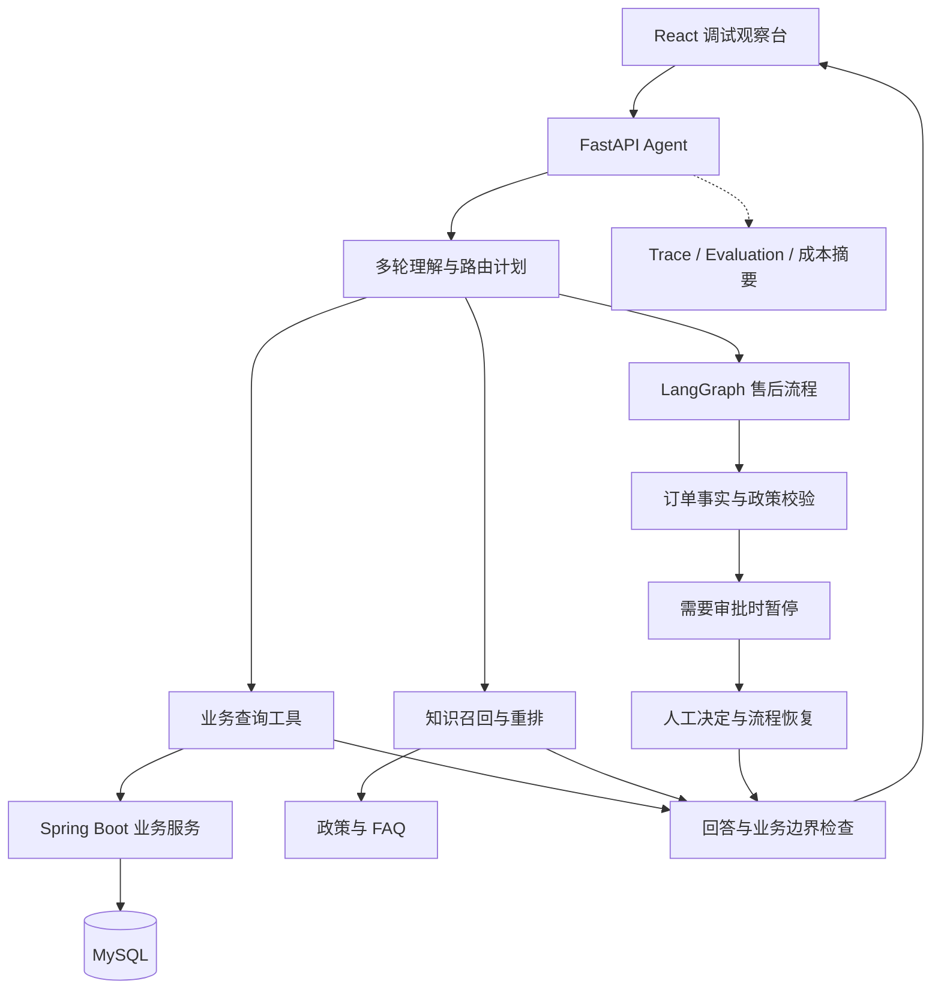

# 电商客服 Agent

面向商品咨询、订单物流和退款退货申请的智能客服系统。通过工具调用获取业务事实，通过 Hybrid RAG 检索政策与 FAQ，并使用 LangGraph 和人工审批管理售后申请流程。

项目包含 **Agent 服务、React 调试观察台、Spring Boot 电商业务服务**，支持在本机观察问题理解、知识检索、工具调用、工作流状态和最终回答。

## 主要功能

| 功能 | 实现内容 |
| --- | --- |
| 多轮理解 | 结合历史对话补全指代，生成结构化查询计划，支持日期、金额和商品条件继承 |
| 业务查询 | 查询价格、库存、订单、物流及退款进度，支持订单筛选、数量统计和金额汇总 |
| Hybrid RAG | 知识域路由、向量与关键词混合召回、模型重排、工具化二次检索和证据覆盖检查 |
| 回答依据 | 政策回答附带来源引用及检索阶段信息，证据不足时说明限制或提示人工核实 |
| 售后工作流 | 核验订单事实与售后条件，区分未发货退款、签收后退货等处理路径 |
| 人工审批 | 支持暂停、批准、拒绝、补充信息与恢复，校验恢复凭证并使用幂等记录避免重复处理 |
| 调试与评测 | 查看 Trace、工具结果、会话状态和成本摘要，运行规则化回归并提交反馈归因 |

## 技术栈与架构

- **Agent：** Python、FastAPI、Pydantic、LangChain、LangGraph。
- **检索：** Embedding、关键词召回、外部 Rerank 接口、LangChain 内存向量索引。
- **调试观察台：** React、TypeScript、Vite。
- **业务服务：** Java 17、Spring Boot、MySQL 8。
- **运行方式：** Docker Compose 启动业务服务，本机启动 Agent 和调试前端。



业务事实以业务接口和受信任的运行上下文为依据，政策解释使用知识库。模型生成的计划仍需经过服务端参数与业务规则检查。

> 当前检索代码使用 `InMemoryVectorStore`。Compose 中保留了 Chroma 服务定义，但默认检索链路没有连接该容器，不需要外部向量数据库即可运行。

## 目录结构

```text
.
├── agent/
│   ├── backend/
│   │   ├── main.py          # FastAPI 入口
│   │   ├── agents/          # Agent 调度与回答处理
│   │   ├── api/             # 请求模型、路由和会话访问控制
│   │   ├── config/          # 配置加载
│   │   ├── context/         # 历史与运行上下文构建
│   │   ├── models/          # 路由和回答模型
│   │   ├── tools/           # 查询计划与业务工具
│   │   ├── integrations/    # 电商接口适配
│   │   ├── knowledge/       # 政策及 FAQ Markdown
│   │   ├── rag/             # 召回、重排、证据检查与缓存
│   │   ├── workflows/       # 售后状态机与审批恢复
│   │   ├── observability/   # Trace 事件
│   │   ├── evals/           # 回归评测执行器
│   │   ├── tests/           # 单元测试
│   │   └── cases.yml        # 默认接口评测用例
│   └── course_runtime/      # 共享日志模块
├── frontend/               # Agent 调试观察台
├── ecommerce-backend/      # Spring Boot 业务服务及其内嵌前端
├── .env.example            # 配置模板，无真实凭据
├── docker-compose.yml      # 业务服务编排
├── requirements.txt        # Python 依赖
├── start-agent.ps1         # 启动 Agent
└── test-agent.ps1          # 单元测试入口
```

`ecommerce-backend/frontend` 是业务服务内嵌页面，根目录 `frontend` 是 Agent 调试观察台，二者用途不同。

## 快速启动

以下命令使用 **PowerShell 7**，默认从仓库根目录开始执行。

### 1. 准备环境

| 依赖 | 要求 |
| --- | --- |
| Python | 3.12 |
| Node.js | 20.19+ 或 22.12+；建议使用 22.x |
| Docker Desktop | 已启动，使用 Linux 容器 |
| 模型服务 | 具有可用的聊天、Embedding、Rerank 接口及相应额度 |

Java 和 Maven 由 Docker 构建阶段提供，本机不必单独安装。首次构建需要下载镜像、npm 包及 Maven 依赖。

### 2. 填写配置

```powershell
Copy-Item .env.example .env
```

编辑 `.env`，至少填写以下三项：

```dotenv
MYSQL_ROOT_PASSWORD=替换为自己的数据库密码
AGENT_SERVICE_AUTH_TOKEN=替换为自己生成的随机令牌
AGENT_OPENAI_API_KEY=替换为模型服务商提供的密钥
```

Agent 启动脚本和 Docker Compose 共用根目录 `.env`。服务鉴权令牌用于 Agent 与业务服务之间的身份校验，不是大模型 API Key。

### 3. 启动业务服务

```powershell
docker compose up -d --build mysql ecommerce-service
docker compose ps
```

这会启动默认链路需要的 MySQL 和电商服务。如需启动可选 Chroma，执行 `docker compose up -d chroma`；启动该容器不会自动切换当前内存向量索引。

### 4. 启动 Agent

```powershell
py -3.12 -m venv .venv
.\.venv\Scripts\python.exe -m pip install -r requirements.txt
pwsh -File .\start-agent.ps1
```

保持终端运行。脚本会进入正确的 backend 目录，并加载根目录 `.env`。

### 5. 启动调试观察台

新开终端，从仓库根目录执行：

```powershell
cd frontend
npm ci
npm run dev -- --host 127.0.0.1
```

| 服务 | 默认地址 |
| --- | --- |
| 调试观察台 | http://127.0.0.1:5173 |
| Agent 健康检查 | http://127.0.0.1:8000/health |
| Agent Swagger 文档 | http://127.0.0.1:8000/docs |
| 电商业务服务 | http://127.0.0.1:8081 |
| MySQL | `127.0.0.1:3306` |

其他项目占用相同端口时，先停止冲突服务，或同步修改 Compose、Agent 启动参数与前端 API 地址。

### 6. 停止服务

Agent 和前端分别在对应终端按 `Ctrl+C`。在根目录停止业务容器：

```powershell
docker compose stop
```

该命令保留 MySQL 数据卷，便于下次继续使用。

## 模型与接口地址配置

| 配置项 | 作用 |
| --- | --- |
| `AGENT_OPENAI_API_KEY` | 聊天和 Embedding 凭据；同服务商重排默认复用 |
| `AGENT_OPENAI_BASE_URL` | OpenAI 兼容服务地址 |
| `AGENT_OPENAI_MODEL` | 当前路由和最终回答使用的聊天模型 |
| `AGENT_EMBEDDING_MODEL` | 文档与问题向量化模型 |
| `AGENT_RAG_RERANK_ENABLED` | 是否启用外部模型重排 |
| `AGENT_RAG_RERANK_MODEL` | 重排模型名称 |
| `AGENT_RAG_RERANK_BASE_URL` | 重排服务地址 |
| `AGENT_RAG_RERANK_API_KEY` | 可选独立重排密钥；跨服务商时单独配置 |
| `AGENT_RAG_RERANK_TIMEOUT_SECONDS` | 重排接口超时秒数 |
| `AGENT_RAG_RERANK_MIN_SCORE` | 相关性阈值，不代表回答准确率 |
| `ECOMMERCE_BASE_URL` | 本机 Agent 访问业务服务的地址 |
| `AGENT_SERVICE_AUTH_TOKEN` | Agent 和业务服务共用的鉴权令牌 |
| `AGENT_SERVICE_BASE_URL` | 容器内业务服务访问 Agent 的地址 |
| `MYSQL_DATABASE` / `MYSQL_ROOT_PASSWORD` | 业务数据库配置 |
| `AGENT_LOG_LEVEL` / `AGENT_ACCESS_LOG` | 日志级别与访问日志开关 |

模板预填 `deepseek-ai/DeepSeek-V4-Pro`、`Qwen/Qwen3-Embedding-4B` 和 `Qwen/Qwen3-Reranker-8B`，分别用于聊天、向量化和重排。模型名称及可用性以服务商账户为准。模板中的 `AGENT_CLASSIFIER_MODEL` 为保留项，当前路由实现使用 `AGENT_OPENAI_MODEL`。

Embedding 只负责把文本转成向量，不生成客服回答。更换聊天模型时修改 `AGENT_OPENAI_MODEL`；更换 Embedding 模型后重启 Agent，让内存索引重新构建。当前聊天与 Embedding 共用服务地址和密钥，跨提供商拆分这两类调用需要调整代码。

前端默认连接 `localhost:8000` 和 `localhost:8081`。需要修改时，创建 `frontend/.env.local` 并重启 Vite：

```dotenv
VITE_AGENT_BASE_URL=http://127.0.0.1:8000
VITE_ECOMMERCE_BASE_URL=http://127.0.0.1:8081
```

不要把 API Key 或服务鉴权令牌放入 `VITE_` 变量，这些变量会暴露给浏览器。

## 体验场景

在调试台选择演示用户后，可以从以下问题开始：

| 场景 | 示例问题 |
| --- | --- |
| 发票 FAQ | 电子发票还没开，抬头填错了，现在能修改吗？ |
| 商品咨询 | 降噪耳机现在的标价、活动价和库存分别是多少？ |
| 优惠规则 | 618满减能和金卡会员券一起用吗？ |
| 订单统计 | 查一下我六月买的耳机订单，一共多少钱？ |
| 多轮筛选 | 上一题后追问：只看六月一号到三号的呢？ |
| 物流查询 | 帮我查订单〈当前用户订单号〉的物流。 |
| 退款申请 | 订单〈未发货订单号〉还没发货，我想申请退款。 |
| 退货申请 | 订单〈已签收订单号〉想申请七天无理由退货。 |
| 证据不足 | 这次活动有没有未公开说明的隐藏优惠券？ |

订单号从当前用户的业务数据中获取。退货资格取决于实际签收日期，固定样例订单不保证一直处于七天期限内。提示人工核实不等同于已经接入真实人工坐席系统。

## API 与会话访问

| 方法 | 路径 | 用途 |
| --- | --- | --- |
| GET | `/health` | Agent 进程健康检查 |
| GET | `/capabilities` | 当前功能清单 |
| POST | `/chat` | 对话、业务查询或售后处理 |
| POST | `/chat/resume` | 根据人工决定恢复待审批流程 |
| GET | `/sessions/{session_id}/trace` | 查看会话事件 |
| POST | `/eval/run` | 运行全部或指定固定评测用例 |
| POST | `/feedback/submit` | 提交反馈并生成归因与临时用例 |

完整请求字段以 `/docs` 为准。以下示例创建新会话查询 FAQ，并读取 Trace：

```powershell
$sessionId = [guid]::NewGuid().ToString()
$body = @{
    session_id = $sessionId
    runtime_user_id = 'U1001'
    user_message = '电子发票开具前能修改抬头吗？'
    history_messages = @()
    reasoning_view = 'off'
} | ConvertTo-Json -Depth 10

$response = Invoke-WebRequest -Uri 'http://127.0.0.1:8000/chat' `
    -Method Post -ContentType 'application/json; charset=utf-8' `
    -Body ([Text.Encoding]::UTF8.GetBytes($body))
$response.Content | ConvertFrom-Json

$headers = @{
    'X-Session-Token' = $response.Headers['X-Session-Token'][0]
    'X-User-Id' = 'U1001'
}
Invoke-RestMethod -Uri "http://127.0.0.1:8000/sessions/$sessionId/trace" -Headers $headers
```

首次 `/chat` 返回 `X-Session-Token`。继续同一会话时需携带该令牌并保持用户身份一致；Trace、审批恢复及反馈接口还要求 `X-User-Id`。调试前端已处理令牌传递。上述 FAQ 示例未携带业务订单上下文，完整业务查询建议通过调试台体验。

审批恢复需要实际返回的 `workflow_id`、`resume_token` 和审批人信息；`decision` 支持 `approved`、`rejected`、`needs_more_info`。“符合申请条件”“人工批准”和“真实退款到账”是不同状态。

## 知识库维护

文档位于 `agent/backend/knowledge`，采用带 YAML 元数据的 Markdown。新增文档时复制已有文件，保留 `policy_id`、`scene_key`、`title`、`score` 等必需字段，并填写适用知识域与版本。

正文写明适用条件、例外和处理方式。价格、库存、订单状态等实时信息应由业务工具查询，避免在政策文档中重复维护。

更新后重启 Agent，清除文档与索引缓存，再检查对应问题的引用和答案。新增知识域还需检查 `rag/domains.py` 中的域配置。

## 调试与回归测试

### 单元测试

完成 Python 依赖安装后，在根目录执行：

```powershell
pwsh -File .\test-agent.ps1
```

### 接口评测

启动服务并配置模型后执行：

```powershell
Invoke-RestMethod -Uri 'http://127.0.0.1:8000/eval/run' `
    -Method Post -ContentType 'application/json' -Body '{}'
```

指定用例时传入 `{"case_id":"对应的用例ID"}`。默认用例来自 `agent/backend/cases.yml`；`cases-v2.yml` 是部分测试使用的补充配置，不会自动替换接口默认用例。接口评测可能调用真实模型并消耗额度。

评测联合检查回答、工具、引用、Trace 和会话状态。定位失败时先看实际回答与业务事实，再核对断言；日期变化、等价表达和策略调整都可能影响固定断言，不能仅凭关键词是否出现判断业务正确性。

### Trace 排查顺序

1. **问题理解：** 查看路由意图、`semantic_query_planned` 和查询条件。
2. **数据获取：** 查看工具参数、状态与业务数据来源。
3. **知识检索：** 查看召回、重排、引用和证据覆盖检查。
4. **售后流程：** 查看资格判断、暂停状态和 `human_approval_required`。
5. **最终回答：** 对照业务状态，检查是否存在无依据的提交、成功或到账承诺。

成本摘要用于观察调用和 token 估算，不直接等同于服务商账单；性能与准确率指标应根据明确的测试条件另外测量。

## 常见问题

| 现象 | 排查方式 |
| --- | --- |
| `/health` 正常但模型失败 | 健康接口只验证进程；检查模型名称、密钥、额度及网络 |
| 模型返回 401、402 或 429 | 根据错误正文检查鉴权、余额或限流，不直接归因为检索效果差 |
| 订单或物流工具失败 | 查看容器状态、业务日志、8081 地址和服务鉴权令牌 |
| 同一会话返回 403 | 检查令牌与用户是否匹配；Agent 重启后新建会话 |
| 修改 `.env` 未生效 | 重启 Agent；已有环境变量优先于文件配置。容器配置修改后重新执行 `docker compose up -d mysql ecommerce-service` |
| MySQL 更换密码后异常 | 已初始化的数据卷不会因修改环境变量自动重置密码，需按现有数据库账户配置处理 |
| 更新知识后仍返回旧内容 | 重启 Agent，检查实际运行目录与引用来源 |
| 退货样例被判断超期 | 核对签收日期；流程依据当前日期判断 |
| 前端能打开但不能发送 | 检查 Agent 是否启动、前端 API 地址和浏览器网络请求 |
| 首次知识问答较慢 | 首次可能涉及向量化与内存索引初始化，结合 Trace 区分检索和模型耗时 |

查看业务容器日志：

```powershell
docker compose logs --tail 100 ecommerce-service
docker compose logs --tail 100 mysql
```

## 使用边界

当前系统用于本地业务演示与 Agent 实战验证。售后流程处理申请与模拟审批，不对接真实支付退款。

会话、Trace、反馈及部分流程状态保存在进程内存中，不能保证重启后恢复；MySQL 持久化的是业务数据。演示用户上下文和审批身份字段不能替代生产登录及审批权限系统。

不要提交 `.env`、模型密钥、服务鉴权令牌、会话令牌或运行记录。`.gitignore` 已配置常见排除项，手动打包时仍需排除这些文件。
